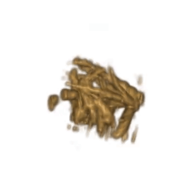

## Liver Blood Vessel Reconstruction



### Environment
```bash
conda create -n liver python=3.8
conda activate liver
pip install -r requirements.txt
```

### Data
Download from [this link](https://drive.google.com/file/d/1wNojK1BHobtHzcWvmJ2z21sAoovLBSqF/view?usp=sharing) and extract.

### Run
```bash
python reconstruct.py
```
